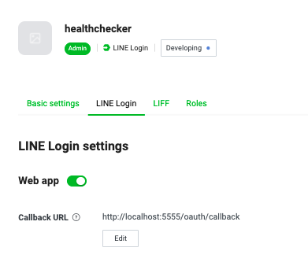

## Go-healthcheck

This golang CLI uses to check website and response time when given a CSV file, calls the Healthcheck Report API to send the statistic of each website.

### Overview

Another assignment that is simple yet challenging. It's been a while since I last visited GOlang. This is fun. Core of the program is pretty straight forward. Ping given websites from CSV file and report it back to Healthcheck API. There are couple of components involve in order to achieve it.

1. Reader: read given file (CSV in this case)
2. Checker: ping given url and aggregate its result
3. Oauth: authorize user with Line login to get access token
4. Reporter: report ping result back to Healthcheck API with received access token
5. Client: clients that program use

Two components I want to highlight as I think they are the most interesting parts in this program.

1. GOroutine when pinging urls

This might not seem interesting to some but for me. This shows case what GO is known for goroutine. With couple of urls, you wouldn't see that much different. But when you have a lot (and I mean a lot) of urls, you will start seeing the different between simple for-loop and goroutine.

2. Oauth with Line login

This gotta be the first time I ever work on Oauth login via CLI. Normal with Oauth, you would require to have callback url register with your provider. In which we use localhost for this instance and we redirect cli-user by open browser for them to continue Logging in with their Line account. While he/she login, we also start http-server which specifically for handling callback from provider.

Project's external dependencies

| Dependencies                                                                     | Description |
| -------------------------------------------------------------------------------- | --- |
| [github.com/kkdai/line-login-sdk-go](https://github.com/kkdai/line-login-sdk-go) | Line Login API in GO |
| [github.com/skratchdot/open-golang](https://github.com/skratchdot/open-golang)   | Open browser for every OS |

### Installation

```sh
# Install dependencies
go install -v .
# Build bin
go build
```

### Requirements

As CLI will try to authenticate user with Line login API, hence it would require user to include following env in order to use LINE Login API

| Field name          | Required/Optional |                                  Description                                  |
| ------------------- | :---------------: | :---------------------------------------------------------------------------: |
| LINE_CHANNEL_ID     |         R         |                           Your provider channel id                            |
| LINE_CHANNEL_SECRET |         R         |                         Your provider channel secret                          |
| BASE_REDIRECT_URL   |         O         | Base redirect url for Line login callback, default url: http://localhost:5555 |

#### Line login callback URL
In your provider, you are required to add callback URL in LINE login section too. Line login documentation can be found [here](https://developers.line.biz/en/docs/line-login/web/integrate-line-login/?fbclid=IwAR3GqvNrZoFjrfF_9kYApgrIiyJyB4W7a-Ua-eD9940hYa53qMPeitgknXQ)



Default callbackURL for program:
```sh
http://localhost:5555/oauth/callback
```

### How to run program

```sh
go-healthcheck <CSV_FILE>
```

e.g.

```sh
# As program is required to include LINE_CHANNEL_ID and LINE_CHANNEL_SECRET, you will have to pass that in when running it
LINE_CHANNEL_ID=XXX LINE_CHANNEL_SECRET=XXX go-healthcheck test.csv
```

### Test

```sh
go test -v ./...
```

### Room for improvements

With given constraint, this project is yet again quickly put together with all expected requirements in mind.

1. Unit test for all functionality in the program
2. Benchmark between WaitGroup and Channel
3. Config for all the ENV required for program
4. CI pipeline for program to make sure all tests pass
